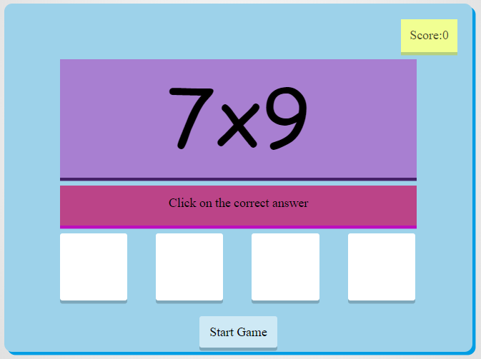
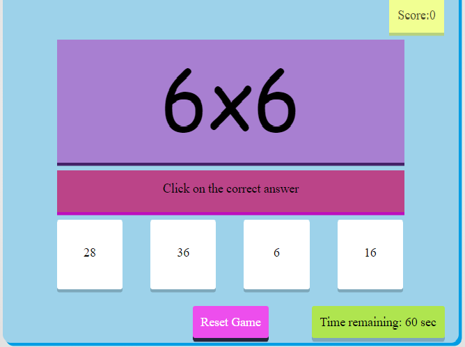
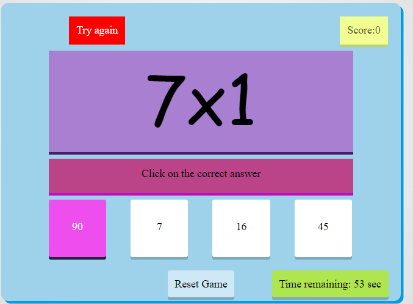
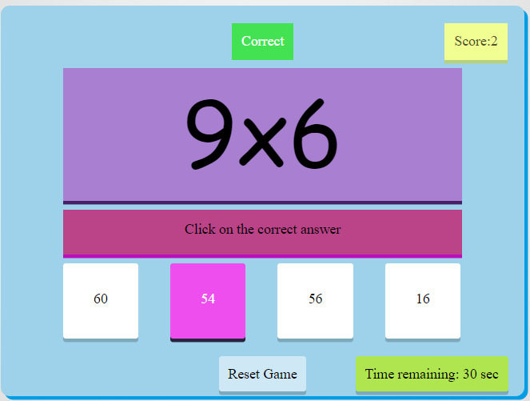
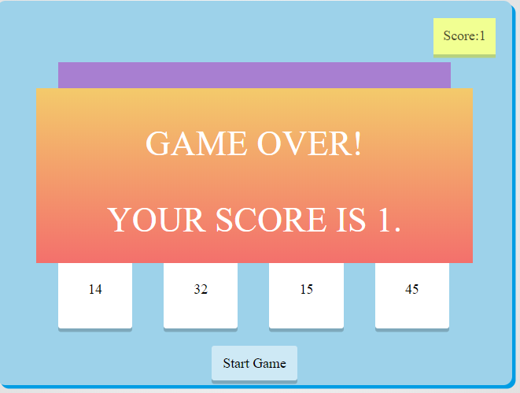

# Maths Game

### It is a simple mathematics game created using HTML, CSS and Javacript. It is a game that projects multiplication questions and 4 options for user to select one of the answer. It is a time based game that plays for 60 seconds and at the last provide you the total score. 

## Screenshots

1. First Page of the Maths Game. When you open the Maths game website this is the first page user will see
When user is ready to play game and hit that start game button, all the answer choices will be shown and time will start also

2. Time Interval and Reset Game:
When user click on “Start Game” button total time of 60sec will start decreasing till 0
While user is playing game, by clicking “Reset Game” is going to reload the webpage

3. Wrong answer indicator will be shown for 1 sec if user click wrong answer box and it prompts for try again

4. Correct Answer indicator is visible for 1 sec when user hit correct answer box. Simultaneously, score will be increased by 1

5. Game over box will be shown when time is over and Reset button changes to Start Game button. It shows the total score.
User can start new game by clicking “Start Game” button.

